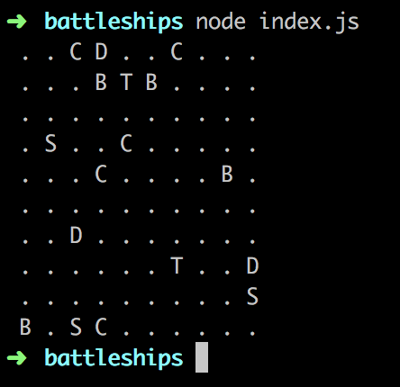

# Battleships

To run the program, simply run clone the repository (via `git clone https://github.com/kevinbluer/battleships` or by downloading the zip) and run the following command: 

```
node index.js
```

Note that the `index.html` file is included for testing within the browser's console.

Lastly, for reference a screenshot of the expected output is shown below.

